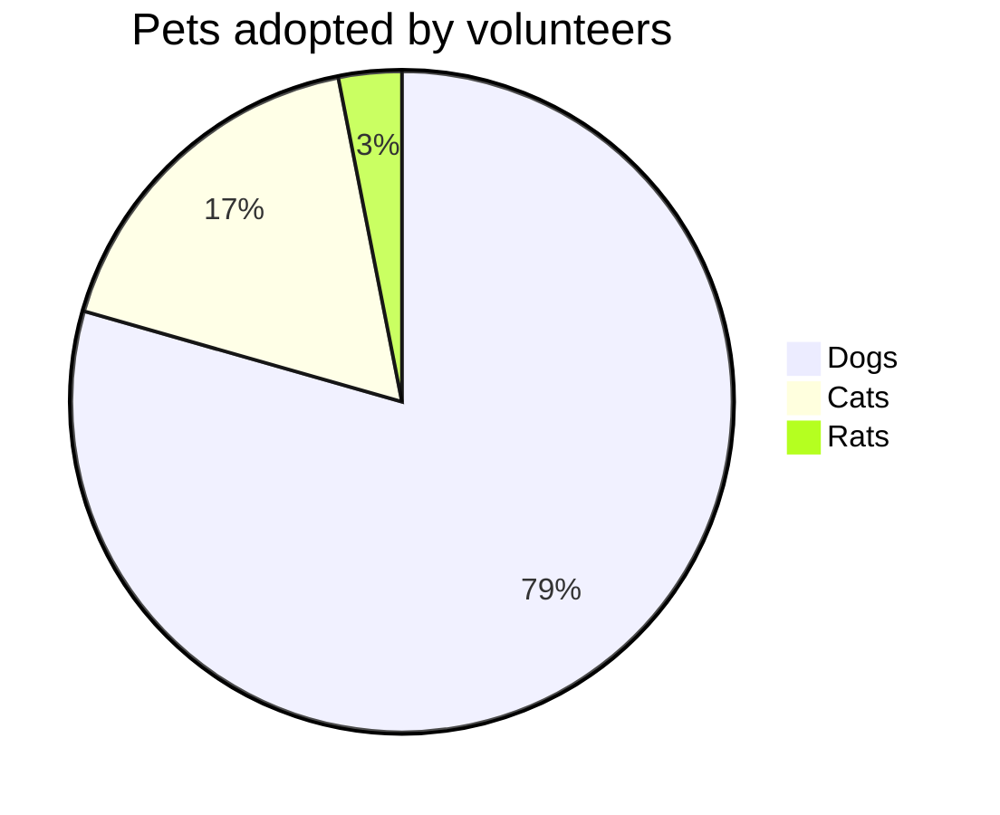

# markdown test #

1 文档：

    https://markdown.com.cn/basic-syntax/

2 样例：

# 标题1
## 标题2
### 标题3
#### 标题4
##### 标题5
###### 标题6


**加粗**

*斜体*

~~删除线~~


> 引用

- 无序列表1
- 无序列表2
- 无序列表3

1. 有序列表1
2. 有序列表2
3. 有序列表3


```
代码块
```

```python
print("Hello, world!")
```

[链接](https://www.google.com)  
  


| 表头1 | 表头2 |
| --- | --- |
| 单元格1 | 单元格2 |
| 单元格3 | 单元格4 |

# katex test #

1 文档：

    https://katex.org/docs/supported.html

    https://freeopen.github.io/mathjax/

2 样例：

$e^{i\pi}+1=0$

$$
sum_{i=0}^n i^2 = \frac{(n^2+n)(2n+1)}{6}
$$

$$  
sum_{i=1}^n \frac{1}{i^2} \quad and \quad \prod_{i=1}^n \frac{1}{i^2} \quad and \quad \bigcup_{i=1}^{2} R 
$$


$$
\begin{array}{c | c}
\mathrm{Bad} & \mathrm{Better} \\\\
\hline \\\\
\int_0^1 x^2 dx & \int_0^1 x^2 \\,{\rm d}x
\end{array}
$$


# mermaid test #

1 文档：

    https://mermaid-js.github.io/mermaid/


2 样例：


